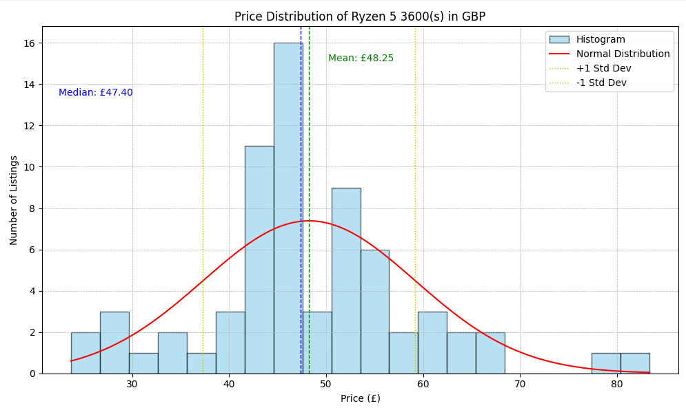

# eBay Product Scanner

This repository contains a Python-based tool for analyzing and visualizing eBay product data, with a focus on CPUs. The tool fetches product information, tags products, and provides insights through data analysis and visualization.

## Features

- Scrape product data from eBay auction results
- Tag products based on their names using customizable tag files, this eliminates bad examples
- Filter products based on tags
- Visualize price distribution of products
- Compare products with CPU benchmark data

## Prerequisites

- Python 3.x
- Required Python packages (install using `pip install -r requirements.txt`):

## Setup

1. Clone the repository:

```bash
git clone https://github.com/yourusername/ebay-product-analyzer.git
cd ebay-product-analyzer
```

2. Install the required packages: 

```bash
pip install -r requirements.txt
```

3. Set up your OpenAI API key in the `datacleaning.py` file:
```python
openai.api_key = 'your-api-key-here'
```
# Usage 

## Run the main script:
_simplecontroller.py

- Enter a search string when prompted e.g Ryzen 7 3700x or RTX 2070
- Choose whether to load saved products or fetch new data.
- The script will automatically check for an existing tag file, create one if it doesn't exist, and tag the products accordingly.
- Choose whether to filter out products based on tags.
- View the product information and statistics in the console output.
- A price distribution plot will be displayed.

## Example output

```

Enter search string (e.g. CPU): Ryzen 5 3600 
Do you want to load saved products? (y/n): n
Collected? HTML Length = 614768
PRODUCT LENGTH: 100
CHECKING TAG FILE
FOUND NONE
GENERATING NAMES
CREATING TAG FILE

...

Do you want to remove products with the tag 'Bundled'? (y/n):y
Do you want to remove products with the tag 'Gaming'? (y/n): n
Do you want to remove products with the tag 'Not Working'? (y/n): y

Median Priced Product:
Name: AMD Ryzen 5 3600 Processor - no box - hard plastic sealed
Price: £47.40
Condition: New
End Time: 0.57 hours
----------------------

Most Expensive Product:
Name: skytech archangel gaming desktop - AMD Ryzen 5 3600 6-Core ProcessorGHz, GTX1650
Price: £83.34
Condition: Used
End Time: 9.58 hours
----------------------

Least Expensive Product:
Name: AMD Ryzen 5 3600 Processor (3.6GHz, 6 Cores, Socket AM4) (heat sink Only)
Price: £23.70
Condition: Used
End Time: 2.78 hours
----------------------

Product Near +1 Std Dev from Mean:
Name: AMD Ryzen 5 3600 Processor (3.6GHz, 6 Core Socket AM4) w/ 16gb 2x8 DDR4-3200
Price: £59.25
Condition: Used
End Time: 7.60 hours
----------------------

Product Near -1 Std Dev from Mean:
Name: AMD Ryzen 5 3600XT 6-core 12-Threads Unlocked Desktop Processor - READ
Price: £37.87
Condition: For parts or not working
End Time: 4.51 hours
----------------------

All Products:

Name: AMD Ryzen 5 3600 6-Core 4.2 GHz Gaming Processor with Wraith Cooler Used
Price: £44.24
Condition: Used
End Time: 0.01 hours
----------------------
...
```

## Example plot



# Customization

- Modify the tag file generation process in datacleaning.py to customize product categorization.
- Adjust the plotting parameters in plotter.py to change the visualization style.

# Contributing
Feel free to submit a Pull Request. This is an old project but I still find it useful for checking prices. 
